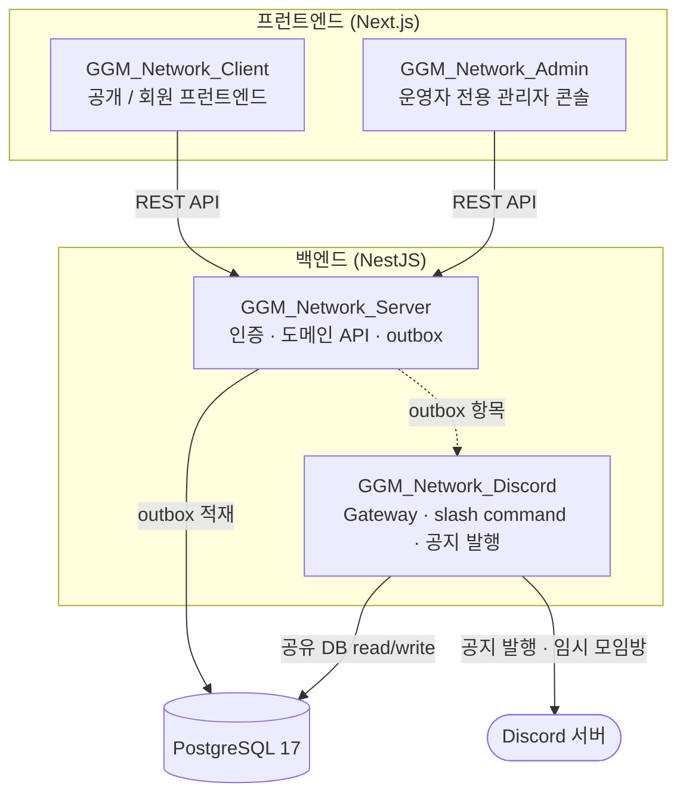

# GGM Network

**경기게임마이스터고 동문이 다시 연결되는 곳**

게임과 IT를 배우고 흩어진 동문들을, 서로의 다음 한 걸음으로 잇는 커뮤니티 플랫폼

 

---

## 우리가 이걸 만든 이유

게임 마이스터고를 졸업하면, 누군가는 스튜디오의 신입 개발자로, 누군가는 아티스트로, 누군가는 기획자로 흩어집니다. 입사하고, 군에 다녀오고, 회사를 옮기고 — 길게는 1~2년씩 소식이 끊기는 일이 자연스러운 사이클입니다.

그래서 **어디서 멈췄든 다시 돌아올 수 있는 자리**가 필요했습니다.

GGM Network는 화려한 동창회 명부가 아닙니다. **같은 학교에서 게임과 IT를 배운 사람들이 서로의 작품을 보고, 일자리와 프로젝트를 나누고, 모임을 열고, 가까운 곳에 누가 있는지 확인하는** 살아 있는 네트워크입니다. 오래 비활성이던 동문도 자동으로 차단되거나 지워지지 않습니다. 마이스터 졸업생의 현실적인 커리어 리듬을 그대로 끌어안도록 설계했습니다.

> 한 줄로 줄이면 — *졸업이 끝이 아니라, 연결의 시작이 되도록.*

---

## 무엇을 제공하나

GGM Network는 **공개 영역**(누구나 볼 수 있는 브랜드·소식·작품)과 **승인 회원 전용 영역**(디렉터리·지도·커뮤니티의 깊은 기능)을 명확히 나눠 운영합니다. 가입 → 이메일 인증 → 프로필 작성 → Discord 연동 → 운영 승인의 흐름을 거치면 동문 전용 기능이 단계적으로 열립니다.

### 도메인 한눈에 보기

| 분류 | 도메인 | 공개 범위 |
|------|--------|-----------|
| 🧭 **발견** | 공개 랜딩(`/`, `/home`) · 뉴스/공지(`/news`) · 동문회 소개(`/about`) | 누구나 |
| 🧭 **발견** | 동문지도(`/map`) · 작품 쇼케이스(`/showcase`) | 누구나(집계/조회) |
| 🔎 **발견** | 통합 검색(`/search`) | 누구나(권한별 결과 범위 적용) |
| 🤝 **커뮤니티** | 커뮤니티 게시판(`/boards`) · 동아리/소모임(`/clubs`) | 목록 공개 · 본문/작성 승인 회원 |
| 💼 **커뮤니티** | 채용·프로젝트(`/career`) · 행사(`/events`) | 목록 공개 · 상세/신청 승인 회원 |
| 🪪 **회원** | 멤버 디렉터리(`/directory`) · 회원 지도(`/map/member`) | 승인 회원 전용 |
| 🎮 **회원** | 회원 허브(`/account`) · 프로필(`/profile`) · 알림(`/notifications`) | 회원 전용 |
| 💝 **회원** | 후원/회비(`/support`) · 인증·동의(`/login`, `/signup`, `/terms` 등) | 공개 안내 · 동의 단일 정책 |

### 🏠 공개 랜딩 & 소식
- **루트 대문(`/`)** 은 브랜드 소개·동문 작품 쇼케이스·공개 지도 미리보기·Discord 가입 게이트를 큐레이션하고, **허브 홈(`/home`)** 은 최신 뉴스·행사·전시·모집 공고를 한자리에 모읍니다.
- **뉴스/공지(`/news`)** 는 공지와 뉴스를 단일 도메인으로 묶어 보여 주고, `/feed.xml`로 **RSS 2.0 피드**까지 제공합니다.
- **통합 검색(`/search`)** 으로 소식·커뮤니티·회원 콘텐츠를 한 입구에서 찾고, 결과 범위는 보는 사람의 권한에 맞춰 적용됩니다.
- **동문회 소개(`/about`)** 가 네트워크의 목적과 공개/회원 경계를 안내합니다.

### 🤝 동문 커뮤니티
- **커뮤니티 게시판(`/boards`)** — 관리자 생성형 게시판, QnA 답변 채택, 익명 게시판, 추천·스크랩·구독, 내 활동 화면(`/boards/my/*`)까지 갖춘 독립 도메인. 분류·공개범위·대상 기수(taxonomy)와 신고 큐를 운영합니다.
- **동아리/소모임(`/clubs`)** — 공개 목록·상세부터 개설 신청, 가입 신청/대기/승인, 내 모임 상태(`/clubs/me`)까지. 개설이 승인되면 공개 동아리 생성 + 창립자 멤버십 + Discord 홍보 채널 동기화가 한 흐름으로 이어집니다.
- **멤버 디렉터리(`/directory`)** — 승인 회원 전용 검색과 단일 멤버 상세. 네트워킹 공개 범위에 따라 회사·직무·위치·소개의 노출을 회원 스스로 정합니다.
- **동문지도(`/map`, `/map/member`)** — 누구나 보는 공개 집계 지도와 승인 회원 전용 클러스터/리스트 지도를 분리. 정확한 집 주소 대신 **정규화한 중심 좌표만** 저장하고, 공개 집계에는 동의한 회원만 포함됩니다.

### 💼 커리어 & 작품
- **채용·프로젝트(`/career`)** — 채용과 프로젝트를 표 기반 통합 리스트로. 목록 메타는 공개, 상세 본문·연락 포인트는 승인 회원만 열람하며, 승인 회원은 관리자 검토 없이 공고를 직접 등록(즉시 공개)할 수 있습니다.
- **작품 쇼케이스(`/showcase`)** — 동문의 작품을 모아 보여 주는 조회 전용 공간(운영자 등록).

### 🎮 회원 경험
- **회원 허브(`/account`)** — 이메일 인증·프로필 보완·Discord 연결·승인 대기를 **게임형 퀘스트 보드**로 안내하고, 포인트·레벨·배지·스트릭 게이미피케이션 보드를 함께 보여 줍니다.
- **프로필(`/profile`)** — 트랙(`programming`/`graphic`/`planning`)·기술스택 자기선언, 프로필/배너 이미지, 지도 공개 범위를 한 흐름으로 저장.
- **행사(`/events`)** — 행사 목록·상세, 참가 신청, 관심 행사 저장(`/account/saved-events`).
- **알림** — 알림 센터(`/notifications`)와 뉴스레터 설정(`/settings/notifications`)을 분리. 광고성 수신 동의가 없으면 뉴스레터는 기본 비활성입니다.
- **후원/회비(`/support`)** — 계좌 안내와 구조형 사용처·절차·FAQ, 누적 집계만 공개하고 개별 입금자는 노출하지 않습니다.

### 🔐 인증 & 동의
- 이메일/비밀번호와 **Google·GitHub OAuth** 가입, 이메일 인증, 비밀번호 재설정.
- 서비스 이용약관·개인정보·마케팅 동의를 **분리 수집**하고, 동의 버전·시각·경로·요청 메타데이터를 감사 이력으로 남깁니다. 모든 동의 항목은 단일 정책 소스를 기준으로 노출됩니다.

### 🤖 Discord 연동
- 가입 → 인증 → 승인 흐름과 계정 연동을 안내하는 **게이트(`/discord`)**. 실제 입장 링크는 승인 회원에게만 열립니다.
- 한국어 표면의 slash command, **임시 모임방(`/rooms`, 30분 미사용 시 자동 삭제)**, 공지 발행, 한국형 서버 부트스트랩과 안내 Embed 카드를 별도 Discord 런타임이 담당합니다.

---

## 🔓 접근 권한 모델

가입 상태에 따라 열리는 기능이 단계적으로 달라집니다. 클라이언트는 접근 규칙을 재구현하지 않고 서버 응답과 잠금 사유를 따릅니다.

| 동작 | 비회원 | 가입 대기(`PENDING`) | 승인 회원(`APPROVED`) |
|------|:------:|:--------------------:|:---------------------:|
| 랜딩·뉴스·소개·공개 지도 열람 | ✅ | ✅ | ✅ |
| 게시판/행사/동아리/커리어 **목록** 열람 | ✅ | ✅ | ✅ |
| 게시판 본문·댓글·추천·스크랩 | — | — | ✅ |
| 커리어 상세 본문·연락 포인트 | — | — | ✅ |
| 멤버 디렉터리·회원 전용 지도 | — | — | ✅ |
| 행사 참가 신청 · 동아리 가입/개설 | — | — | ✅ |
| 커리어 공고 직접 등록 | — | — | ✅ |
| Discord 서버 입장 링크 | — | — | ✅ |

> 거부(`REJECTED`) 상태는 잠금 패널과 사유 안내로 처리되며, 오래 비활성인 회원도 자동으로 차단·삭제되지 않습니다.

---

## 🏗 아키텍처 — 4개의 앱

GGM Network는 역할이 분명한 **4개의 독립 애플리케이션**으로 구성된 모노레포입니다. 공개/회원 화면, 운영, API, Discord 런타임을 분리해 각각을 안전하게 발전시킵니다.

| 앱 | 역할 | 스택 |
|----|------|------|
| **GGM_Network_Client** | 공개/회원 프런트엔드 (랜딩·디렉터리·게시판·지도·커리어 등) | Next.js · React · Tailwind CSS |
| **GGM_Network_Admin** | 운영자 전용 관리자 콘솔 (운영자 세션 비밀번호 접근) | Next.js · React · Tailwind CSS |
| **GGM_Network_Server** | NestJS API 서버 (인증·도메인 API·outbox 적재) | NestJS · PostgreSQL · JWT |
| **GGM_Network_Discord** | Discord 런타임 (게이트웨이·slash command·공지 발행·임시 모임방) | NestJS · discord.js · PostgreSQL |

**설계 메모**
- **공개/회원 이중 토큰 정책** — 행정·공지·뉴스 같은 일반 영역은 라이트 surface(`paper-panel`), 작품 쇼케이스·Discord 게이트 같은 게임/IT 정체성 영역은 다크 surface(`dev-panel`)로 분리합니다. 관리자 콘솔은 라이트 운영 톤을 유지합니다.
- **outbox 발행 패턴** — 공지/행사 발행은 API 저장을 막지 않는 outbox 방식으로 적재하고, 실제 Discord 발행과 재시도는 Discord 런타임이 담당합니다.
- **권한 게이트** — 비회원 / 미승인(`PENDING`) / 거부(`REJECTED`) / 승인(`APPROVED`) 상태별로 열리는 기능이 단계적으로 달라집니다. 클라이언트는 접근 규칙을 재구현하지 않고 서버 응답과 잠금 사유를 따릅니다.

<b>📂 16개 기능 도메인 상세 펼쳐 보기</b>

 

| 도메인 | 핵심 라우트 | 요약 |
|--------|------------|------|
| 공개 랜딩 | `/`, `/home` | 브랜드 대문과 최신 소식·행사·전시·모집 허브 홈 분리 운영 |
| 뉴스/공지 | `/news`, `/news/[id]`, `/feed.xml` | NOTICE·NEWS 단일 도메인 + RSS 2.0 피드 |
| 행사 | `/events`, `/events/[eventId]` | 게시/마감 행사, 참가 신청, 관심 행사 저장 |
| 커뮤니티 게시판 | `/boards`, `/boards/[boardSlug]/*`, `/boards/my/*` | 관리자 생성형 게시판, QnA 채택, 익명, 추천/스크랩/구독, 신고 큐 |
| 동아리/소모임 | `/clubs`, `/clubs/[slug]`, `/clubs/new`, `/clubs/me` | 개설 신청·가입·대기·승인, Discord 홍보 채널 동기화 |
| 멤버 디렉터리 | `/directory`, `/directory/[id]` | 승인 회원 전용 검색 + 네트워킹 공개범위 기준 상세 |
| 동문지도 | `/map`, `/map/member` | 공개 집계 지도 / 회원 전용 클러스터·리스트, 정규화 좌표만 저장 |
| 채용·프로젝트 | `/career`, `/career/jobs`, `/career/projects`, `/career/[id]`, `/career/write` | 표 기반 통합 리스트, 승인 회원 직접 등록 |
| 작품 쇼케이스 | `/showcase` | 운영자 등록 view-only 동문 작품 |
| 후원/회비 | `/support` | 계좌 안내 + 구조형 사용처/절차/FAQ + 누적 집계 |
| 회원 허브 | `/account`, `/account/saved-events` | 온보딩 퀘스트 보드 + 포인트/레벨/배지/스트릭 |
| 프로필 | `/profile` | 트랙·기술스택 자기선언, 프로필/배너 이미지, 지도 공개범위 |
| 알림 | `/notifications`, `/settings/notifications` | 알림 센터 + 뉴스레터 수신 설정 분리 |
| 동문회 소개 | `/about` | 네트워크 목적·공개/회원 경계·안전 경로 기반 문의 안내 |
| 인증/가입 | `/login`, `/signup`, `/auth/*`, `/terms`, `/privacy`, `/consents/marketing` | 이메일·OAuth 가입, 분리 동의 + 감사 이력 |
| Discord 봇/연동 | `/discord` (+ 별도 Discord 런타임) | 게이트 안내, slash command, 임시 모임방, 공지 발행 |

---

## 🧰 기술 스택

### 프런트엔드 (Client / Admin)

| 영역 | 사용 기술 |
|------|-----------|
| 프레임워크 | **Next.js 16.2.6** · **React 19.2.4** · **react-dom 19.2.4** |
| 스타일링 | **Tailwind CSS 4** (`@tailwindcss/postcss`, `postcss`) |
| 인터랙션 | **Framer Motion 12** *(client 전용)* |
| 폼 & 검증 | **react-hook-form 7** · **@hookform/resolvers 5** · **Zod 4** *(client 전용)* |
| 콘텐츠 | **react-markdown 10** · **remark-gfm 4** · **remark-breaks 4** *(client 전용)* |
| 언어 | **TypeScript 5** |
| 품질 | **ESLint 9** · **eslint-config-next 16.2.6** |
| 테스트 | **Vitest 4** · **Testing Library**(react / user-event / jest-dom) · **@vitejs/plugin-react 6** · **jsdom 29** |

### 백엔드 (Server / Discord)

| 영역 | 사용 기술 |
|------|-----------|
| 런타임 | **Node.js 22** · **TypeScript 5.7** |
| 프레임워크 | **NestJS 11** (`@nestjs/core` · `common` · `platform-express` · `config`) |
| 데이터베이스 | **PostgreSQL 17** · **pg 8** |
| 인증 & 보안 | **@nestjs/jwt 11** · **bcryptjs 3** · **@nestjs/throttler 6** · **cookie-parser** |
| 검증 | **class-validator** · **class-transformer** |
| 메일 | **nodemailer 8** |
| Discord | **discord.js 14** *(discord 전용)* |
| 공통 런타임 | **RxJS 7** · **reflect-metadata** |
| 테스트 | **Jest 30** |

---

## 🌱 참여하기

GGM Network는 경기게임마이스터고 동문을 위한 커뮤니티이자, 그 동문들이 함께 키워 가는 제품입니다.

- 🎓 **동문이라면** — 가입 → 이메일 인증 → 프로필 작성 → Discord 연동 → 운영 승인을 거치면 디렉터리·지도·커뮤니티 전용 기능이 열립니다.
- 🛠 **기여하고 싶다면** — 4개 앱(Client · Admin · Server · Discord) 저장소에서 이슈와 PR을 환영합니다. 기능을 더할 때는 공개/회원 권한 경계와 이중 토큰 정책을 함께 지켜 주세요.
- 💬 **소통** — 제품 안의 Discord 게이트(`/discord`)를 통해 커뮤니티로 이어집니다.

### 저장소

| 저장소 | 설명 |
|--------|------|
| [`GGM_Network_Client`](https://github.com/GGM-Network/GGM_Network_Client) | 공개/회원 Next.js 프런트엔드 |
| [`GGM_Network_Admin`](https://github.com/GGM-Network/GGM_Network_Admin) | 운영자 전용 Next.js 관리자 콘솔 |
| [`GGM_Network_Server`](https://github.com/GGM-Network/GGM_Network_Server) | NestJS API 서버 (인증·도메인 API·outbox) |
| [`GGM_Network_Discord`](https://github.com/GGM-Network/GGM_Network_Discord) | NestJS Discord 런타임 (게이트웨이·slash command·공지 발행·임시 모임방) |

경기게임마이스터고 동문 네트워크 · 졸업이 끝이 아니라, 연결의 시작이 되도록.

